# Literature Review: Lean 4 Formalisation of Cellular Automata

This document reviews the literature relevant to a Lean 4 formalisation of one-dimensional cellular automata for language recognition, structured around the five questions from the definitions context.

---

## 1. Standard Formalisation of CA for Language Recognition

### 1.1 Core Definition: How Does Ours Compare?

The standard treatment is Kutrib (2009), which defines:

> "A two-way cellular automaton (CA) is a system ⟨S, δ, #, A, F⟩"

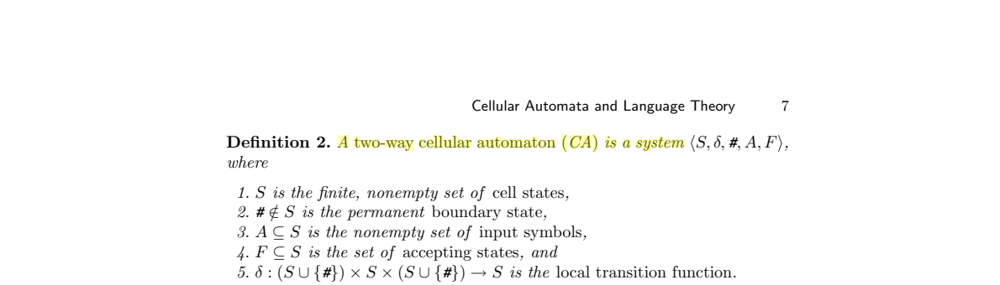

where the boundary state `#` is explicitly outside the state set:

> "# ∉ S is the permanent boundary state"

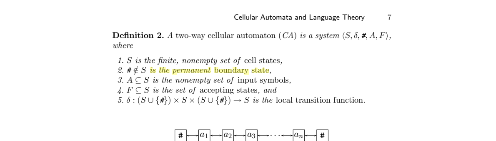

Smith (1972), the origin paper, gives the informal definition:

> "a cellular automaton is an array of identical finite-state Moore machines, called cells, which are uniformly interconnected."

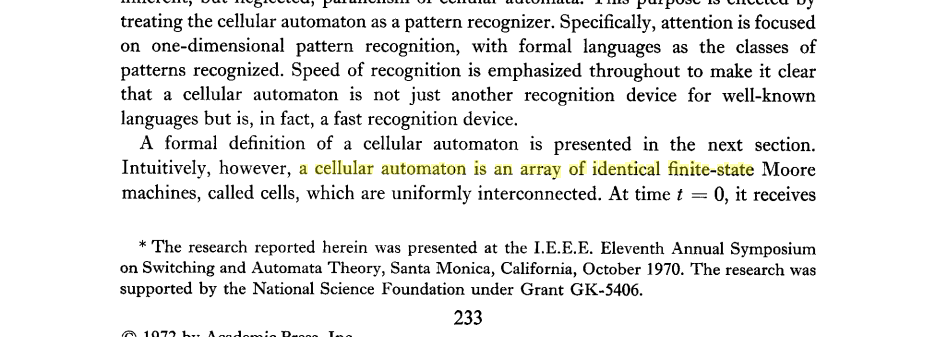

Mazoyer (1996) uses the most minimal form — just states and a local rule:

> "A cellular automaton 𝒜 is a couple (Q, δ) where Q is a finite set"

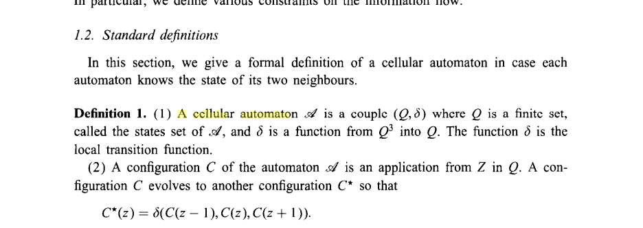

Note that Mazoyer's paper concerns the Firing Squad Synchronization Problem — it defines a CA purely as $(Q, \delta)$ with no input alphabet, acceptance set, or language recognition mechanism. This is the minimal "dynamical systems" view of CA.

Delacourt & Poupet (2015) generalise to d dimensions:

> "A cellular automaton (CA) is a quadruple A = (d, Q, N, δ)"

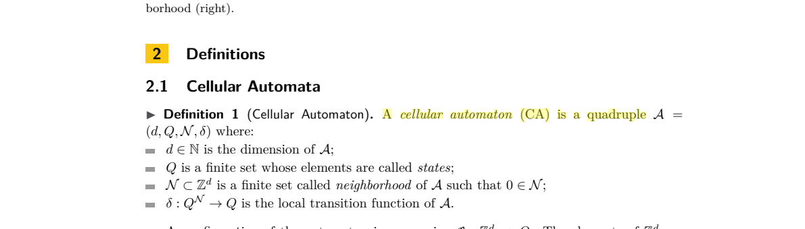

### 1.2 Input/Output Embedding: Our Approach vs. Standard

**Standard approach (Kutrib 2009):** The input alphabet $A$ is a **subset** of the state set $S$. Acceptance is determined by a set $F \subseteq S$ of accepting states. There is no separate output alphabet — acceptance is binary (state in $F$ or not).

**Our formalisation:** Uses separate types with explicit maps:
- `embed : α → Q` injects input symbols into the state space
- `project : Q → β` extracts output symbols from states

This **transducer view** is more general: it handles both language recognition (when $\beta = \text{Bool}$) and functional computation (arbitrary $\beta$). The standard approach is the special case where `embed` is an inclusion and `project` is membership in $F$.

Our `embed` map generalises both the Kutrib approach ($A \subseteq S$, i.e. `embed` is an inclusion) and the Mazoyer approach (no input alphabet at all, i.e. the initial configuration is specified directly as states). In the Mazoyer view, there is no distinction between input symbols and cell states — the CA simply starts from a configuration in $Q^\mathbb{Z}$. Our `embed : \alpha \to Q` recovers this by allowing `embed` to be any injection, and also handles the case where the input alphabet is genuinely separate from the state space (e.g. when the state space includes internal bookkeeping states that are not valid input symbols).

The transducer perspective is closest to Grandjean, Richard & Terrier (2012), who define CA functions via a projection $\pi : S \to O$:

> "computable in strict real time if there exists a cellular automaton (S, f) and a projection π"

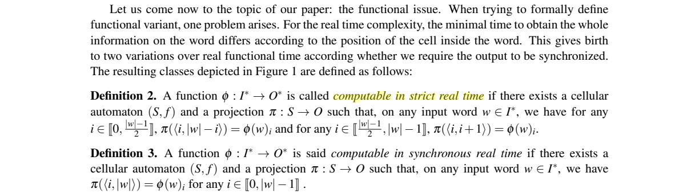

So the embed/project pattern generalises both the standard acceptance model and GRT's functional perspective.

### 1.3 Border/Boundary Handling

The literature is inconsistent. Three approaches appear:

**Approach 1: Permanent boundary (Kutrib 2009).** The boundary `#` is not a cell state — it's a fixed symbol that appears as neighbor input for border cells but can never be produced by δ. The transition function has domain $(S \cup \lbrace \mathtt{\char`\#} \rbrace)^3 \to S$.

**Approach 2: Quiescent border (Smith 1972, Martin 1994).** The border state is in $S$ and satisfies $\delta(q, q, q) = q$.

Smith requires that non-input cells be in a quiescent state:

> "quiescent cell is a cell in a specially designated state, the quiescent state"

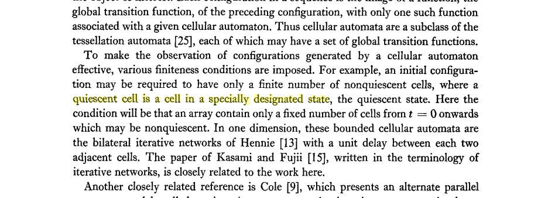

Martin (1994) makes the quiescent condition explicit:

> "We have a special state for cellular automata, namely the quiescent state, often given as q. Its particularity is δ(q, q, q) = q."

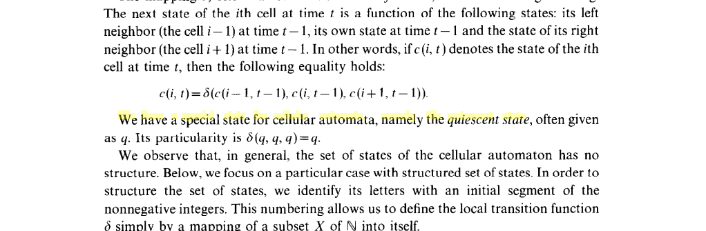

**Approach 3: No constraint (our formalisation).** The border state `embed(none)` has no a priori constraints — $\delta(\text{border}, \text{border}, \text{border})$ can be anything. Our Results 4 and 5 prove that a quiescent or dead border can always be imposed without changing the recognised language, so this generalisation is conservative. This is a genuine contribution: many papers implicitly assume a quiescent border without proving it is WLOG.

---

## 2. Acceptance Schemes

### 2.1 Standard Approach

Kutrib (2009) defines acceptance via the leftmost cell entering an accepting state:

> "An input w is accepted by an (O)CA (IA) M if at some time i during its course of computation the leftmost cell enters an accepting state."

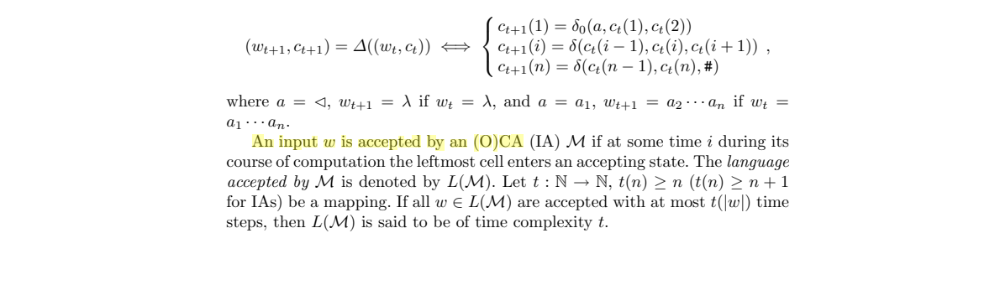

Time complexity is then defined as:

> "L(M) is said to be of time complexity t"

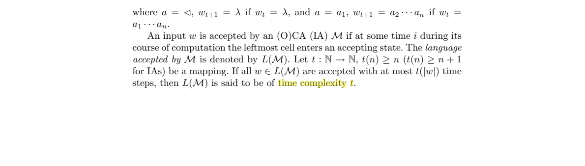

### 2.2 Acceptance Modes in the Literature

Our formalisation parameterises acceptance by a generic `AcceptanceScheme(t, p)` — time step $t(n)$ and position $p(n)$ as functions of input length. The standard schemes are:

| Scheme | Time | Position | Source |
|---|---|---|---|
| **Real-time** | $n - 1$ (CA) or $2n - 2$ (IA) | leftmost cell | Smith (1972), Kutrib (2009) |
| **Linear-time** | $c \cdot n$ for constant $c > 1$ | leftmost cell | Kutrib (2009), Bucher & Čulik (1984) |
| **Unrestricted** | any finite time | leftmost cell | Kutrib (2009) |

Our `rt` scheme reads at time $n-1$, position 0 — matching the standard real-time convention.
Our `rtRight` scheme reads at time $n-1$, position $n$ — this reads the **rightmost** cell at real-time. This is non-standard but natural for OCA where information flows left-to-right.

#### Standard (leftmost cell) acceptance

Smith (1972) defines acceptance for bounded cellular spaces (BCS): a string is accepted if

> "the accept cell to pass eventually into a set of states including an accept state"

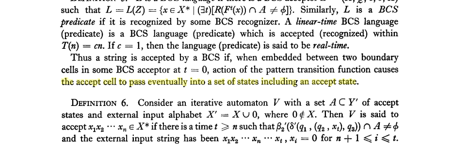

with real-time being the special case $c = 1$:

> "If c = 1, then the language (predicate) is said to be real-time"

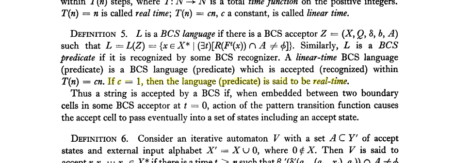

Ibarra, Kim & Mang (1985) use the same convention for two-way CA:

> "the leftmost node enters an accepting state within T(n)"

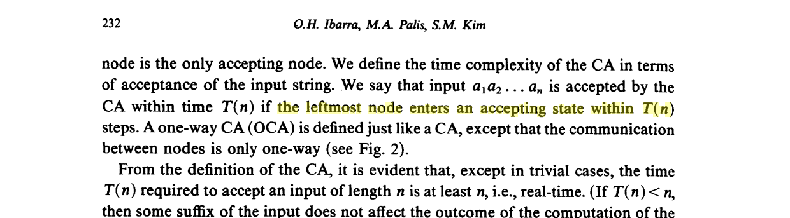

Kutrib (2009) gives the modern standard definition (Section 2.1 above). Importantly, the acceptance condition is **existential** — the leftmost cell may oscillate between accepting and non-accepting states:

> "the leftmost cell will enter accepting as well as non-accepting states during a computation"

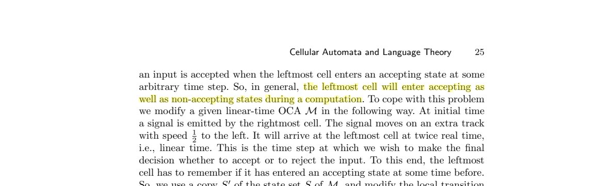

This means complementation is not trivial — one cannot simply swap accepting and non-accepting states:

> "simply interchanging accepting and non-accepting states"

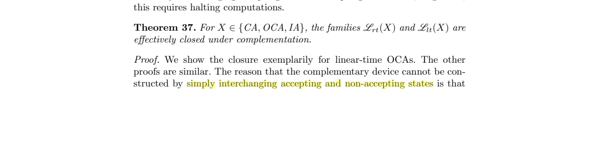

is **not** sufficient, because:

> "an input is accepted when the leftmost cell enters an accepting state at some arbitrary time step"

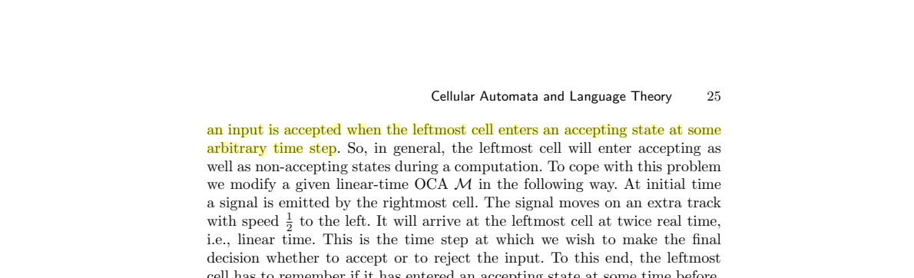

#### Rightmost cell acceptance (OCA)

Dyer (1980) defines OCA acceptance via the **rightmost** non-boundary cell:

> "rightmust non-# cell, the accepting cell, enters a state in"

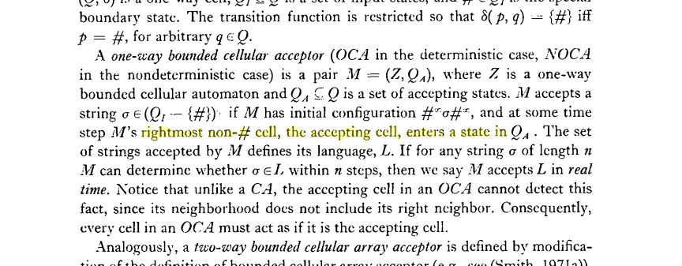

Note: This is the rightmost non-boundary cell, not the leftmost. Since OCA information flows right-to-left, the rightmost cell is where information arrives last — making it the natural output cell. Our `rtRight` scheme captures this convention. The conversion to leftmost-cell acceptance (by reversing the input) is standard.

#### All-cell acceptance (ACA)

Ibarra, Kim & Mang (1985) introduced the ACA model where acceptance requires **all** cells to be in accepting states simultaneously:

> "all nodes must simultaneously be in accepting states for the input to be accepted"

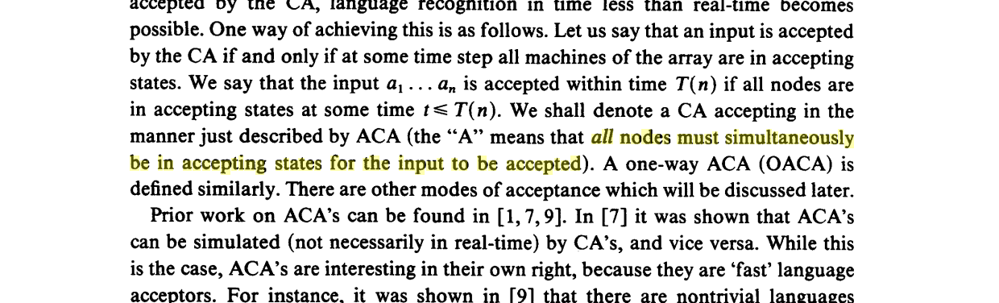

They also note that this is not the only possibility:

> "There are other modes of acceptance which will be discussed later"

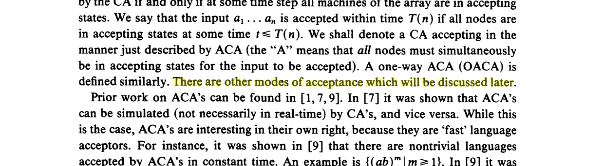

Modanese (2019) revived the ACA model for sublinear-time recognition, defining it formally as a CA with an

> "acceptance condition depends on the states of all cells"

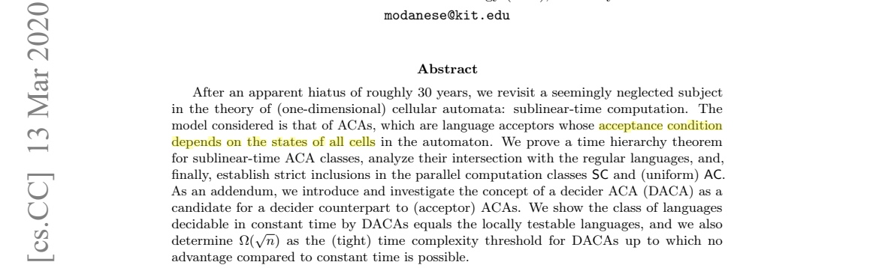

> "An ACA is a CA C with a non-empty subset A ⊆ Q \ {q} of accept states"

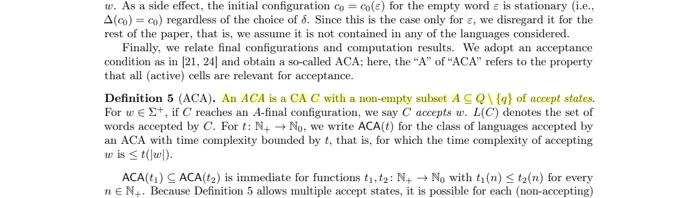

where acceptance requires reaching an "A-final configuration" — i.e. all active cells are simultaneously in accepting states.

#### Parallel output / transducer mode

Kutrib & Malcher (2012) define CA transducers with a parallel I/O mode:

> "input/output mode for cellular automaton transducers is called parallel"

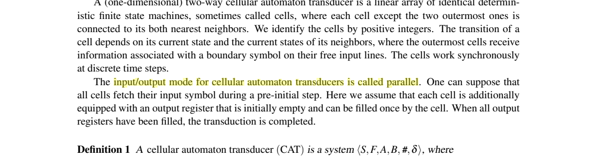

where each cell independently produces output. This is not a single-cell acceptance model — instead, the transition function maps to $S \times (B^* \cup \{\bot\})$ and each cell emits symbols over time.

#### GRT functional modes

Grandjean, Richard & Terrier (2012) define three functional acceptance modes for CA computing functions $\varphi : I^* \to O^*$:

**Strict real-time** — each output position $i$ is read at its earliest possible time along the light cone:

> "computable in strict real time if there exists a cellular automaton (S, f) and a projection"

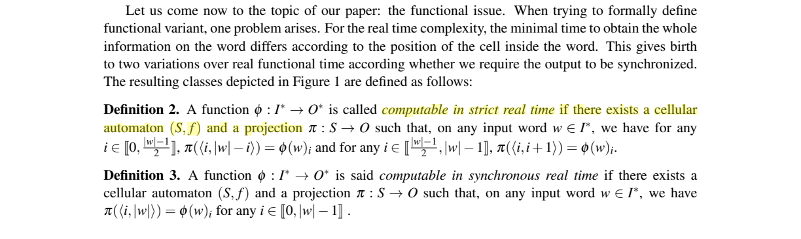

**Synchronous real-time** — all outputs read at time $|w|$:

> "computable in synchronous real time if there exists a cellular automaton (S, f) and a projection"

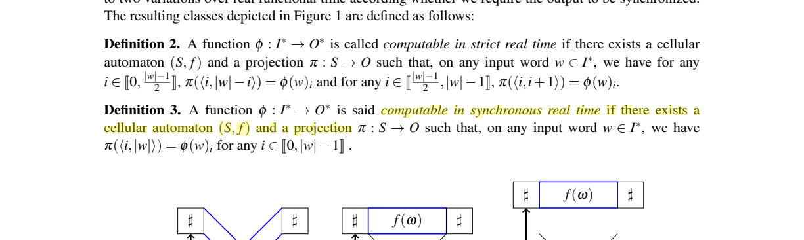

**Linear-time** — outputs at time $k \cdot |w|$ for some constant $k > 1$:

> "computable in linear time if there exists k"

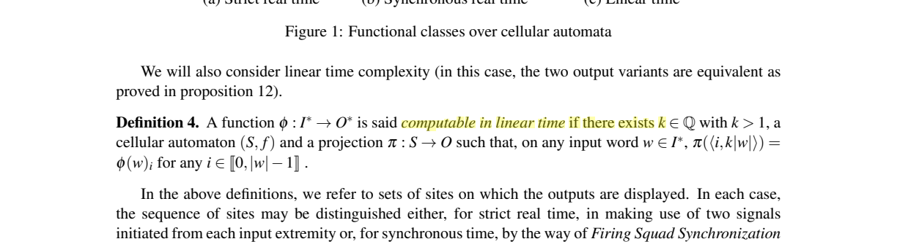

These are transducer acceptance modes (each cell position has an associated output), not language acceptance per se. Our separation of `embed`/`project` maps follows this pattern.

#### Summary

Exponential-time acceptance does not appear as a standard named class in the CA literature. The hierarchy focuses on real-time vs. linear-time vs. unrestricted.

---

## 3. Quiescent vs. Dead States

### 3.1 Quiescent States

"Quiescent" is standard terminology. Our definition `Quiescent q ↔ δ(q, q, q) = q` matches the literature exactly:

- Smith (1972): the quiescent state condition is used implicitly
- Martin (1994): states it explicitly as $\delta(q, q, q) = q$
- Kutrib (2009): the permanent boundary state `#` plays a similar role but is outside $S$

### 3.2 Dead States

Our definition `Dead q ↔ ∀ a c, δ(a, q, c) = q` — a state that never changes regardless of its neighbors — is used in the literature but under varying names.

Mazoyer & Reimen (1992) define a border state $\lambda$ with exactly this property in their speedup theorem:

> "A cell once in state 3. will remain in that state forever, i.e. ,f(x _ p,. , x _ 1, 2, s, , . . , xp) = i, whatever the xi"

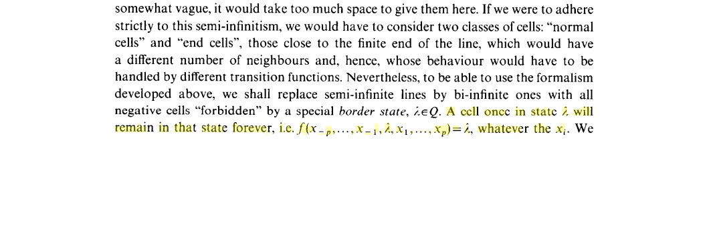

This states precisely $\delta(x_{-p}, \ldots, \lambda, \ldots, x_p) = \lambda$ for all $x_i$ — exactly our `Dead` predicate. The term "dead state" also appears in Inoue & Nakamura (1979) and Mrykhin & Okhotin (2023), but without a formal definition.

The distinction `Dead q → Quiescent q` (proved in our formalisation) is implicit in the literature but rarely stated explicitly. Dead states are stronger: they remain fixed regardless of neighbor states, while quiescent states only remain fixed when _all_ neighbors are also quiescent.

---

## 4. One-Way vs. Two-Way CA

### 4.1 Definitions

Our formalisation uses a two-way (radius-1) neighborhood $\{p-1, p, p+1\}$. The literature distinguishes:

- **CA** (two-way): neighborhood $\{p-1, p, p+1\}$, information flows in both directions
- **OCA** (one-way): neighborhood $\{p, p+1\}$, information flows right-to-left only

Kutrib (2009):

> "If the flow of information is restricted to one-way, the resulting device is a one-way cellular automaton (OCA)."

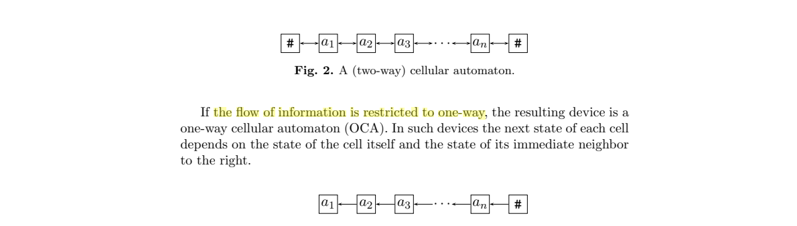

Dyer (1980) introduced OCA:

> "information is allowed to move only in one direction"

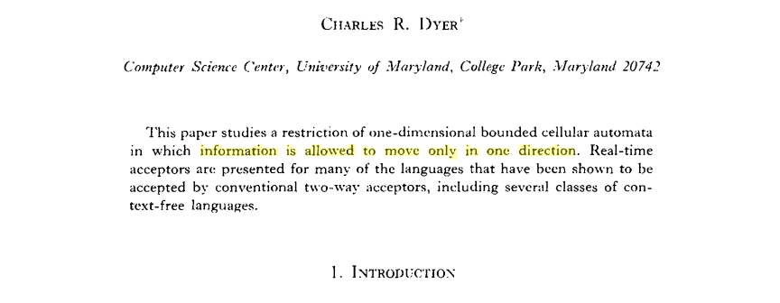

He gives a formal definition of the one-way cell:

> "a one-way cell C is a pair C := (Q, δ), where Q is the finite, nonempty state set"

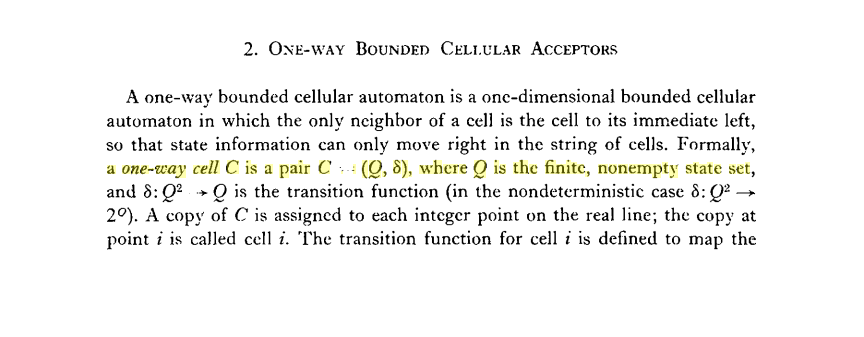

with $\delta : Q^2 \to Q$ as transition function — each cell sees only itself and its left neighbor.

---

## 5. Key References to Add

### 5.5 Formal Verification of Automata Theory

No prior formalisation of CA **language theory** exists in any proof assistant. However, there is prior work on formalising (a) other classes of automata and (b) cellular automata for non-language-theoretic purposes.

#### Automata theory formalisations (not CA)

**Coq / Rocq:** Doczkal, Kaiser & Smolka (2013, 2018) formalised regular language theory (~3000 lines Coq/Ssreflect): DFA/NFA, regular expressions, Myhill–Nerode, WS1S, two-way automata.

> "Paulson [28] formalized automata theory, including the Myhill–Nerode theorem and Brzozowski derivatives"

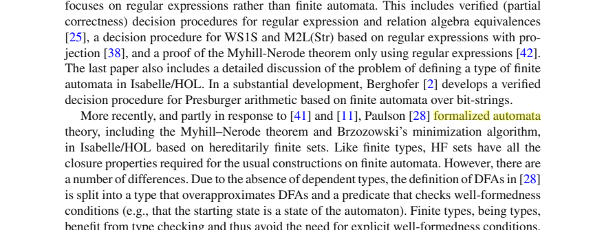

Ramos (2015) formalised context-free language theory in Coq (~42,000 lines), including the pumping lemma for CFLs — the first such formalisation. This covers pushdown automata and CFGs, but not CA.

**Isabelle/HOL:** Paulson formalised regular language theory. Wimmer formalised timed automata. Nipkow (2004) contributed functional automata to the Archive of Formal Proofs. A formalisation of DFA/NFA conversion from the textbook "Automata Theory: An Algorithmic Approach" was done in Isabelle/HOL (2018). No CA language theory in any Isabelle entry.

#### Cellular automata formalisations (not language theory)

**Lean:** Silvási & Tomášek (2020) formalised bounded 2D grids and CA simulation (Game of Life style) in Lean 3. In a follow-up (2020b), they extended the framework with boundary conditions and canonical forms. Their work focuses on computational simulation of CA (evaluating generations, matrix representations) — not on language recognition, acceptance, or complexity classes.

**Coq:** A 2018 technical report (Laboratoire d'Informatique, Paris Diderot) presents a partial Coq formalisation of a field-based Firing Squad Synchronization Problem (FSSP) solution. This is the closest prior work to ours: it defines a 1D cellular automaton in Coq and proves correctness of a synchronization protocol. However, FSSP is a coordination problem (all cells must enter a firing state simultaneously), not a language recognition problem — there is no input alphabet, acceptance set, or complexity class analysis.

**HOL4:** Myreen (2025) formally verified logic circuit implementations within Conway's Game of Life in HOL4 ("GOL in GOL in HOL"). This work formalises what it means for a pattern to implement a gate in the 2D GoL CA, but concerns circuit verification rather than language theory.

#### Assessment

Our formalisation is the first to mechanise CA **language recognition** results — including acceptance schemes, time complexity, quiescent/dead state properties, transducer composition, and the advice framework — in any proof assistant. Prior CA formalisations address simulation (Silvási & Tomášek), synchronization (FSSP in Coq), or circuit verification (Myreen), none of which involve language classes $\mathscr{L}(\text{CA}_\text{rt})$ or $\mathscr{L}(\text{OCA}_\text{rt})$.

---

## Comparison: Our Formalisation vs. Standard Definitions

| Aspect | Kutrib (2009) Standard | Our Lean 4 Formalisation | Relationship |
|---|---|---|---|
| Tuple | ⟨S, δ, #, A, F⟩ | `CellAutomaton α β Q` with `δ`, `embed`, `project` | Ours is more general (transducer view) |
| Input alphabet | $A \subseteq S$ | `embed : α → Q` | Standard is special case |
| Output | $F \subseteq S$ (binary) | `project : Q → β` (general) | Standard is special case ($\beta = \text{Bool}$) |
| Boundary | # ∉ S, permanent | `embed(none)`, no constraints | Ours is more general; Results 4–5 prove WLOG |
| Quiescent | Assumed or implicit | `Quiescent q ↔ δ(q,q,q) = q` — explicit predicate | Same definition, stated explicitly |
| Dead | Used informally | `Dead q ↔ ∀ a c, δ(a,q,c) = q` — explicit predicate | Same notion, named and proved `Dead → Quiescent` |
| Acceptance | Leftmost cell enters $F$ at time $\le t(n)$ | `AcceptanceScheme(t, p)` parameterised | Ours generalises (variable position) |
| Configuration space | $S^n$ (bounded) or $S^{\mathbb{Z}}$ (unbounded) | `Config α := ℤ → α` (unbounded) | Standard unbounded form |
| Indexing | Usually 1-based (cells $1..n$) | 0-based (cells $0..n-1$) | Convention difference only |

The key design decisions — separate embed/project maps and unconstrained border — are deliberate generalisations that enable the transducer composition theory (Result 7) and advice framework (Results 8–12) while remaining conservative over standard language recognition.

---

## References

- Bucher, W. & Čulik II, K. (1984). On real time and linear time cellular automata. *RAIRO — Informatique Théorique*, 18(4), 307–325. [doi:10.1051/ita/1984180403071](https://doi.org/10.1051/ita/1984180403071)

- Delacourt, M. & Poupet, V. (2015). Comparing 1D and 2D real time on cellular automata. In *Proc. STACS 2015*, LIPIcs 30, 367–378. [doi:10.4230/LIPIcs.STACS.2015.367](https://doi.org/10.4230/LIPIcs.STACS.2015.367)

- Doczkal, C. & Smolka, G. (2018). Regular language representations in the constructive type theory of Coq. *Journal of Automated Reasoning*, 61, 521–553. [doi:10.1007/s10817-018-9460-x](https://doi.org/10.1007/s10817-018-9460-x)

- Dyer, C. R. (1980). One-way bounded cellular automata. *Information and Control*, 44(3), 261–281. [doi:10.1016/S0019-9958(80)90164-3](https://doi.org/10.1016/S0019-9958(80)90164-3)

- Grandjean, A., Richard, G. & Terrier, V. (2012). Linear functional classes over cellular automata. *EPTCS* 90, 185–197. [doi:10.4204/EPTCS.90.15](https://doi.org/10.4204/EPTCS.90.15)

- Ibarra, O. H., Palis, M. A. & Kim, S. M. (1985). Fast parallel language recognition by cellular automata. *Theoretical Computer Science*, 41, 231–246. [doi:10.1016/0304-3975(85)90073-8](https://doi.org/10.1016/0304-3975(85)90073-8)

- Inoue (Seki), S. (1979). Real-time recognition of two-dimensional tapes by cellular automata. *Information Sciences*, 19, 179–198. [doi:10.1016/0020-0255(79)90018-X](https://doi.org/10.1016/0020-0255(79)90018-X)

- Kutrib, M. (2009). Cellular automata and language theory. In R. Meyers (Ed.), *Encyclopedia of Complexity and Systems Science*, 800–823. Springer. [doi:10.1007/978-0-387-30440-3_54](https://doi.org/10.1007/978-0-387-30440-3_54)

- Kutrib, M. & Malcher, A. (2012). Transductions computed by one-dimensional cellular automata. *EPTCS* 90, 198–209. [doi:10.4204/EPTCS.90.16](https://doi.org/10.4204/EPTCS.90.16)

- Martin, B. (1994). A universal cellular automaton in quasi-linear time and its S-m-n form. *Theoretical Computer Science*, 123(2), 199–237. [doi:10.1016/0304-3975(92)00076-U](https://doi.org/10.1016/0304-3975(92)00076-U)

- Mazoyer, J. (1996). On optimal solutions to the firing squad synchronization problem. *Theoretical Computer Science*, 168(2), 367–404. [doi:10.1016/0304-3975(96)00084-9](https://doi.org/10.1016/0304-3975(96)00084-9)

- Mazoyer, J. & Reimen, N. (1992). A linear speed-up theorem for cellular automata. *Theoretical Computer Science*, 101(1), 59–98. [doi:10.1016/0304-3975(92)90150-E](https://doi.org/10.1016/0304-3975(92)90150-E)

- Modanese, A. (2019). Sublinear-time language recognition and decision by one-dimensional cellular automata. In *Proc. DLT 2020*, LNCS 12086, 251–265. [doi:10.1007/978-3-030-48516-0_19](https://doi.org/10.1007/978-3-030-48516-0_19)

- Mrykhin, M. & Okhotin, A. (2023). On hardest languages for one-dimensional cellular automata. *Information and Computation*, 295, Part A, 105076. [doi:10.1016/j.ic.2022.105076](https://doi.org/10.1016/j.ic.2022.105076)

- Myreen, M. O. & Carneiro, M. (2025). GOL in GOL in HOL: Verified circuits in Conway's Game of Life. In *Proc. ITP 2025*, LIPIcs 352, 25:1–25:18. [doi:10.4230/LIPIcs.ITP.2025.25](https://doi.org/10.4230/LIPIcs.ITP.2025.25)

- Ramos, M. V. M. & de Queiroz, R. J. G. B. (2015). Context-free language theory formalization. *arXiv:1505.00061*. [arxiv:1505.00061](https://arxiv.org/abs/1505.00061)

- Silvási, F. & Tomášek, M. (2020a). Lean formalization of bounded grids and computable cellular automata defined thereover. *Science of Computer Programming*, 198, 102519. [doi:10.1016/j.scico.2020.102519](https://doi.org/10.1016/j.scico.2020.102519)

- Silvási, F. & Tomášek, M. (2020b). Extending Lean cellular automata framework — boundary conditions and properties of canonical forms. *Acta Electrotechnica et Informatica*, 20(1), 33–40. [doi:10.15546/aeei-2020-0005](https://doi.org/10.15546/aeei-2020-0005)

- Smith III, A. R. (1972). Real-time language recognition by one-dimensional cellular automata. *Journal of Computer and System Sciences*, 6(3), 233–253. [doi:10.1016/S0022-0000(72)80004-7](https://doi.org/10.1016/S0022-0000(72)80004-7)